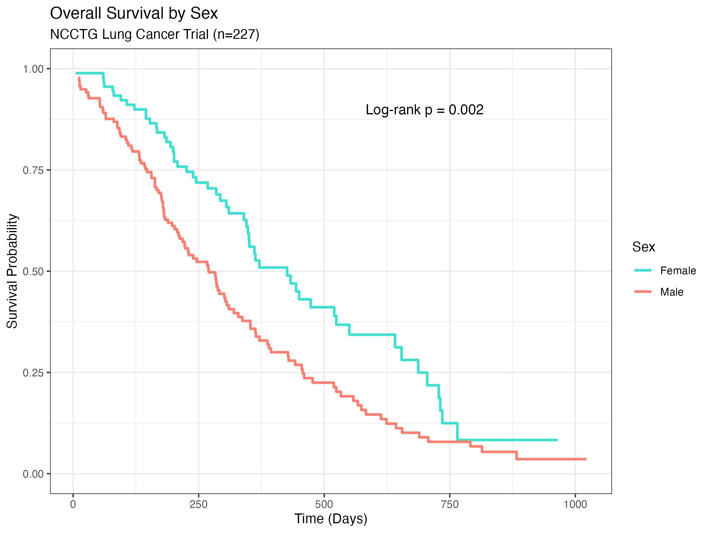
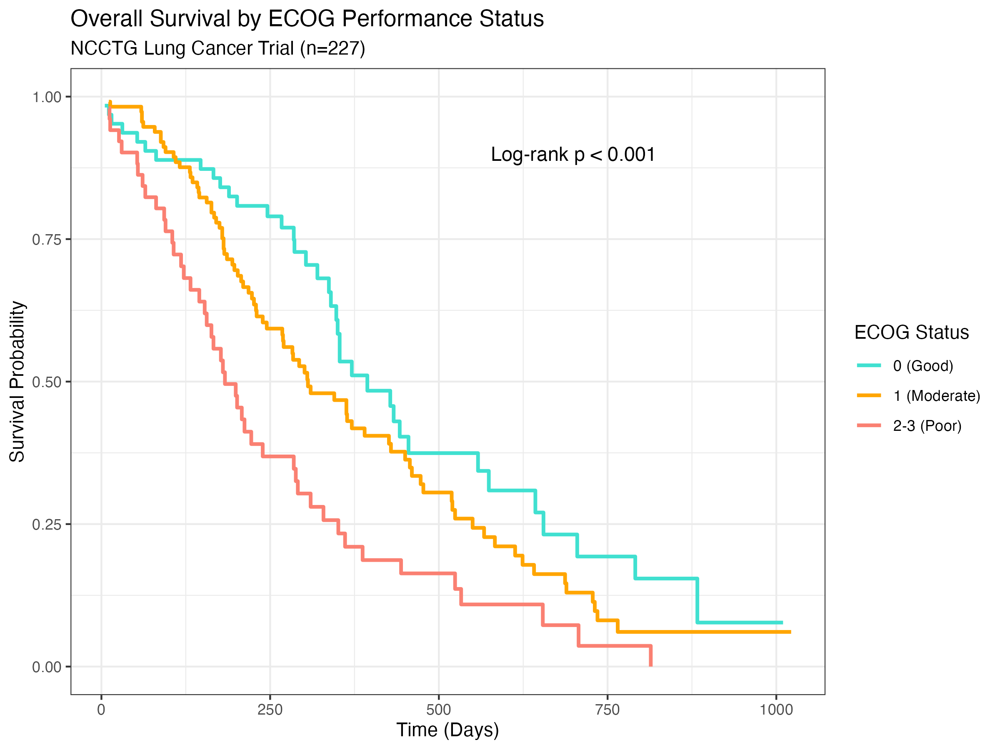
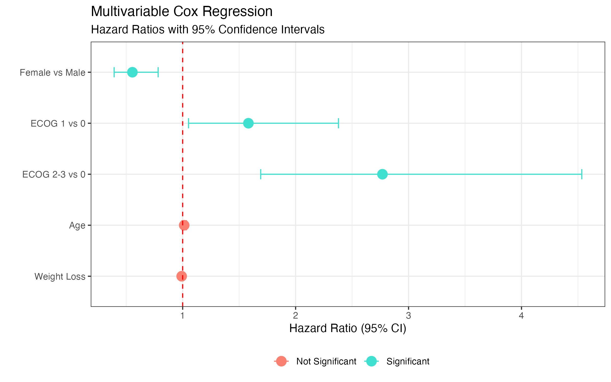

# 🫁 NCCTG Lung Cancer Survival Analysis

### Real-World Clinical Trial Data | Cox Regression | Kaplan-Meier Analysis

---

## 📌 Overview

This project analyzes overall survival in **227 advanced lung cancer patients** from the 
North Central Cancer Treatment Group (NCCTG) clinical trial — a real dataset available 
in R's `survival` package.

The analysis investigates how **sex** and **ECOG performance status** influence survival 
outcomes using Kaplan-Meier curves, log-rank tests, and multivariable Cox proportional 
hazards regression.

---

## 📊 Dataset

- **Source:** NCCTG Lung Cancer Trial (North Central Cancer Treatment Group)
- **Patients:** 227 advanced lung cancer patients
- **Follow-up:** Up to 1,022 days
- **Variables:** Age, sex, ECOG performance status, Karnofsky scores, weight loss, 
meal calories
- **Outcome:** Overall survival (days), event = death

---

## 📐 Methods

1. **Data Cleaning** — Recoded variables, handled missing values, combined ECOG 3 
with ECOG 2 due to small sample size (n=1)
2. **Kaplan-Meier Analysis** — Survival curves stratified by sex and ECOG status
3. **Log-rank Tests** — Tested for significant differences in survival between groups
4. **Multivariable Cox Regression** — Adjusted hazard ratios for sex, ECOG, age, 
and weight loss

---

## 🔑 Key Findings

- **Females survived significantly longer than males** (HR = 0.55, p < 0.001) — 
45% lower risk of death after adjusting for other factors
- **ECOG performance status was a strong predictor of survival:**
  - ECOG 1 vs 0: HR = 1.58 (p = 0.028) — 58% higher risk
  - ECOG 2-3 vs 0: HR = 2.77 (p < 0.001) — nearly 3x higher risk
- **Age and weight loss were not significant** after adjusting for sex and ECOG
- Log-rank tests confirmed significant survival differences by sex (p = 0.002) 
and ECOG (p < 0.001)

---

## 📈 Key Figures

### Kaplan-Meier: Overall Survival by Sex


### Kaplan-Meier: Overall Survival by ECOG Performance Status


### Forest Plot — Multivariable Cox Regression


---

## ⚠️ Limitations

- Single-institution clinical trial data — may not generalize to all lung cancer populations
- Missing data in weight loss (n=14) and meal calories (n=47) — excluded from 
primary model
- ECOG 3 group combined with ECOG 2 due to only 1 patient
- No treatment information available in this dataset

---

## 🛠️ Tools Used

- R
- survival
- ggplot2
- dplyr

---

## 👩‍💻 Author

**Marianna Wicks, MPH, ODS, CRC** Precision Medicine | Oncology Data | Biostatistics

---

## ⭐ Key Skills Demonstrated

- Survival analysis with real clinical trial data
- Kaplan-Meier estimation and log-rank testing
- Multivariable Cox proportional hazards regression
- Hazard ratio interpretation and visualization
- Data cleaning and missing data handling
- Reproducible research workflow in R

---

## ▶️ How to Run

1. Clone the repository
2. Open in RStudio
3. Set working directory to project root
4. Run scripts in order:

```r
source("scripts/01_data_exploration.R")
source("scripts/02_kaplan_meier.R")
source("scripts/03_cox_regression.R")
source("scripts/04_visualizations.R")
```
